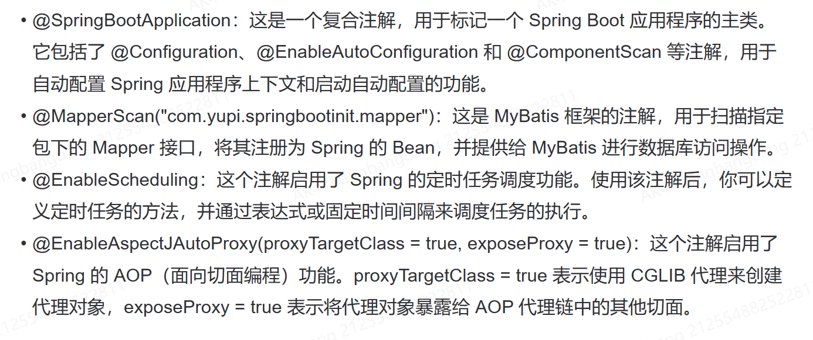

```java
// todo 如需开启 Redis，须移除 exclude 中的内容
@SpringBootApplication(exclude = {RedisAutoConfiguration.class})
// 使用 Spring Boot 框架，并排除 Redis 的自动配置  

@MapperScan("com.mxf.springbootinit.mapper")
// 扫描指定包路径下的 MyBatis mapper 接口  

@EnableScheduling
// 启用 Spring 的任务调度功能  

@EnableAspectJAutoProxy(proxyTargetClass = true, exposeProxy = true)
// 启用 AspectJ 的自动代理功能，代理目标类，并暴露代理对象  

public class MainApplication {
    public static void main(String[] args) {
        SpringApplication.run(MainApplication.class, args);
    }
}
```


